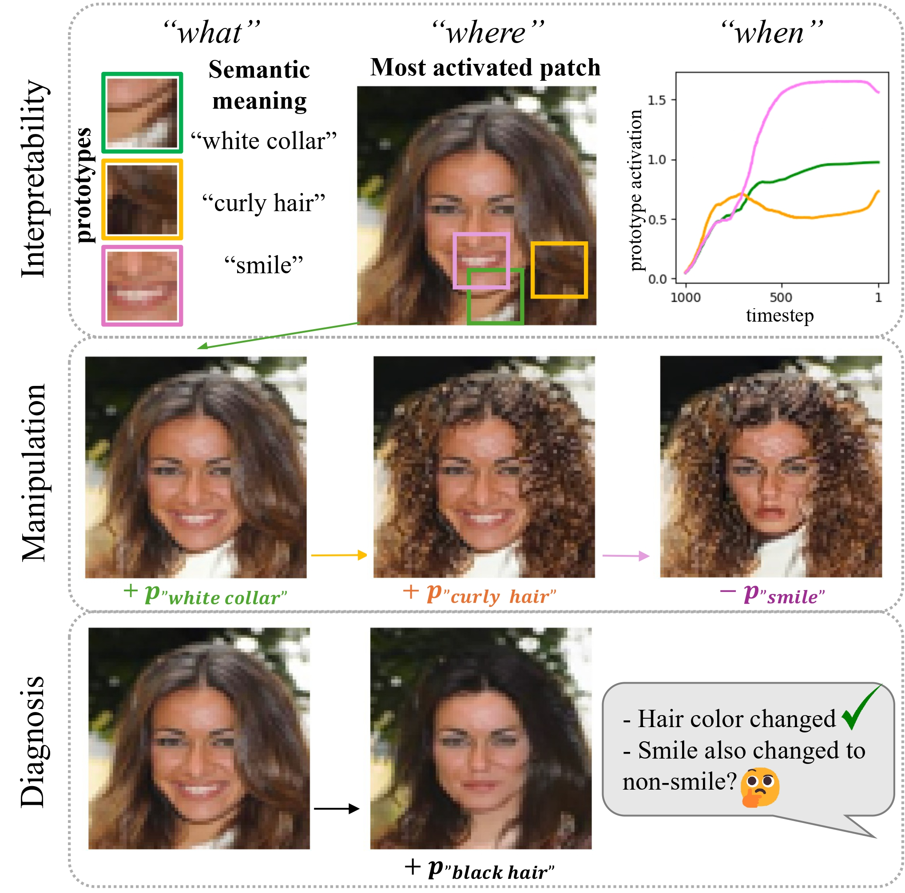

# Patronus: Prototype-Assisted Transparent Diffusion Model 


<p align="center">
  
</p>

Public pytorch implementation for our paper [Patronus: Bringing Transparency to Diffusion Models with Prototypes](https://arxiv.org/abs/2503.22782). 

If you find this code helpful in your research, please cite the following paper:

```
@article{weng2025patronus,
  title={Patronus: Bringing Transparency to Diffusion Models with Prototypes},
  author={Weng, Nina and Feragen, Aasa and Bigdeli, Siavash},
  journal={arXiv preprint arXiv:2503.22782},
  year={2025}
}
```

----------------------------

## Getting Started

### 0. Virtual environment set-up
The code is implemented in Python 3.9 using the Pytorch library. We only tested the code with Pytorch 3.9. One way of getting all the requirements is by using virtualenv and the requirements.txt file.

`pip install -r requirements.txt`

### 1. Train Patronus

Run the following command:
`python ./train/train_patronus.py`
configarations (including the dataset choice) are in `./train/train_config.py`.

### 2. Interprability 

**Visualization of the learned prototypes:**

Run: 
`python ./analysis/interpretability/visualize_prototype.py` to get the visulized prototypes. Configurations are in `./analysis/interpretability/visualization_config.py`.
It will plot the result under `./records/vis_prototype/` (in the form of Fig. 5 in the paper).


### 3. Manipulation

Code under `analysis/manipulation/manipulation_p.ipynb`

### 4. Diagonosis

For Diagnosis part of experiment, manipualtion on dataset are needed to create mannully controlable bias dataset for analysis, which contains in `analysis/diagnosis/manipulate_ds.ipynb`. After training the model with the biassed dataset, diagonose it with `analysis/diagnosis/diagnosis.ipynb`.


### 5. Evaluation

Evaluations in the paper could be found under `analysis/evaluation`. Including: Sec 4.1 **Semantic Meaning of the Learned Prototypes** (reconstruction/variations, interpolation, visualizing prototypes, consistency, extrapolation) and Sec 4.2 **Prototype Quality** (under `p_quality.ipynb`).   

For **generation quality**:   
a) *Conditional Sampling*:  
Run `python ./train/conditional_sampling.py --dataset dataset_name --version_num version_num` to generate conditional samples first. Then compute the FID score by `python -m pytorch_fid source_path_1 source_path_2`. Notice that you might need to resize the test set images to the same as generated samples.

b) *Unconditional Sampling*:  
For unconditioal sampling, firstly a latent ddim needs to be trained, by running `python ./train/train_latent_ddim.py --dataset dataset_name --version_num version_num`.  
Then run `python ./train/unconditional_sampling.py --dataset dataset_name --version_num version_num --latent_version latent_version`.  
FID score could be computed with the same package metioned above.


## Code Structure

* `./analysis`: including codes for interpretability, manipulation, evaluation and diagonosis. 
* `./models`: including codes for patronus model, diffusion model, loss function etc.
* `./records`: where the results go to.
* `./train`: training and inference (sampling) scripts.
* `global_config.py`: global dir path for the repo.


## Data

We use 5 datasets in this work, which could be downloaded from their offical website listed below:
* [CelebA](https://mmlab.ie.cuhk.edu.hk/projects/CelebA.html)
* [Fashion-mnist](https://github.com/zalandoresearch/fashion-mnist)
* [CIFAR-10](https://www.cs.toronto.edu/~kriz/cifar.html)
* [FFHQ](https://github.com/NVlabs/ffhq-dataset)
* [CheXpert](https://stanfordmlgroup.github.io/competitions/chexpert/)


## About the Name: Patronus

The word *Patronus* originated from ancient Rome, that a *patronus* was the protector, sponsor, and benefactor of the client (source: [Wikipedia](https://en.wikipedia.org/wiki/Patronage_in_ancient_Rome)).

It is now more widely known by J.K. Rowling's work, *Harry Potter*, where a *Patronus* is a protective charm used to repel Dementors:
> The *Patronus* is a kind of positive force, a projection of the very things that the dementor feeds upon — hope, happiness, the desire to survive — but it cannot feel despair, as real humans can, so the dementors can’t hurt it. -- Harry Potter and the Prisoner of Azkaban

I find this symbolic alignment meaningful: our aim and vision for this work is to build explainability tools for diffusion models that act as **protective mechanisms**, diagnosing and defending against bias and irresponsible behaviors in generative AI.


## Contact
Please use the issue tracking tool to report bugs or email directly to [ninwe@dtu.dk](ninwe@dtu.dk). If you have further questions regarding the paper, please feel free to email [ninwe@dtu.dk](ninwe@dtu.dk) as well.